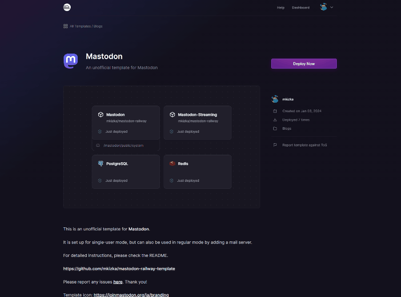
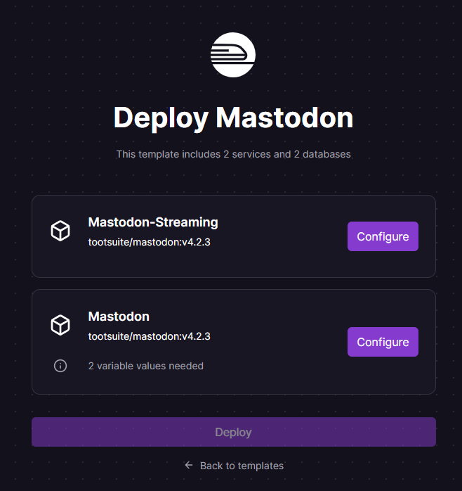
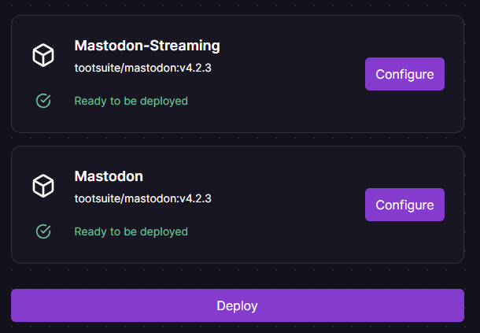
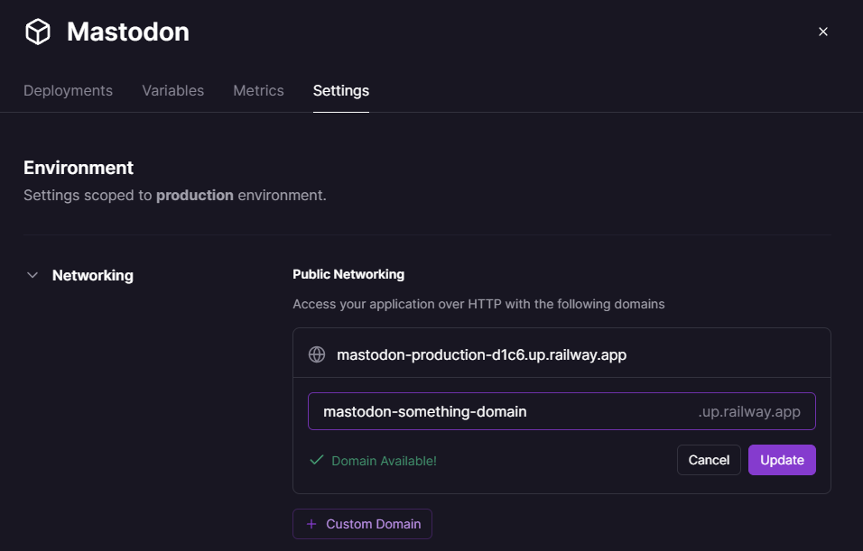
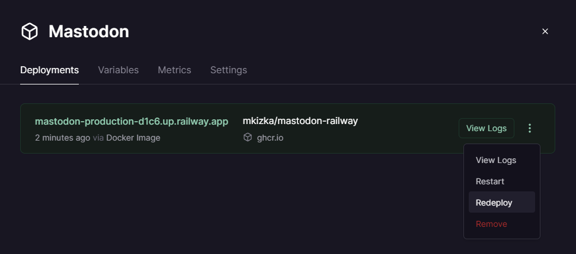
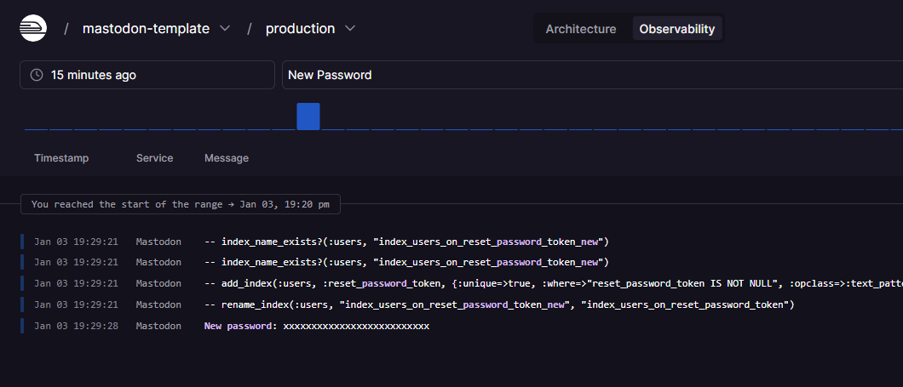
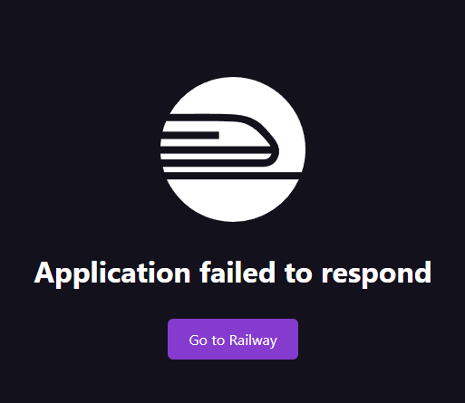

[English](./README.md) | [日本語](./README_ja.md)

# mastodon-railway-template
A template for deploying Mastodon on [Railway](https://railway.app).

**Note: This template only works with the Hobby plan or higher.**

## Usage

### 1. Click on "Deploy on Railway"

### 2. Click "Configure" for each service and set the environment variables

You must click "Save Config" for all settings. Below are the instructions for configuring each service.

#### Mastodon-Streaming
No need to edit as it syncs with Mastodon's environment variables.

#### Mastodon
| Variable Name | Description | Default |
| --- | --- | --- |
| OWNER_USERNAME | Specify the username for the admin account to be created at startup. | |
| OWNER_EMAIL | Specify the email address for the admin account to be created at startup. It won't be used until the mail server is set up. | |

No other settings need to be edited.

For more details on each setting, refer to the [official documentation](https://docs.joinmastodon.org/admin/config/).

### 3. Click "Deploy" after completing the settings
You can deploy when everything is marked as "Ready to be deployed" as shown in the image below.

### 4. Set Up a Domain (Optional)
You can set up a domain from the "Settings". You can use a free domain from Railway, or your own custom domain. 

After setting the domain, be sure to click "Redeploy".

Note: If you change the domain of Mastodon-Streaming, make sure to change it before changing Mastodon. Then, redeploy both in the order you changed them.

### 5. A few minutes later, click on the "Mastodon" service and access the URL
The URL can be found under "Deployments" as shown below.

That's it!

### 6. Sign in to the Owner Account
You can search for the service's execution logs in "Observability" at the top of the project screen.

By searching for "New Password", you can find the password for the Owner account created at the start of Mastodon.

You can use this password and email address to log in to the admin account from the login screen.

## Troubleshooting

You may encounter a message like this.

- Try waiting a bit and then reload
- Redeploy

These actions can sometimes resolve the issue.

## ⚠️⚠️Caution⚠️⚠️
- After starting to use Mastodon, please do not change the domain.
- Uploaded images are saved on a mounted volume with a capacity of 5GB. It is advisable to set up S3 or similar from the start if needed.
- Railway charges based on usage, so please avoid increasing follows excessively. [You can also set usage limits in the settings.](https://docs.railway.app/reference/usage-limits)
