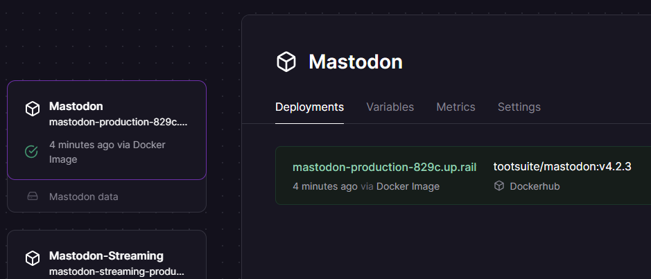
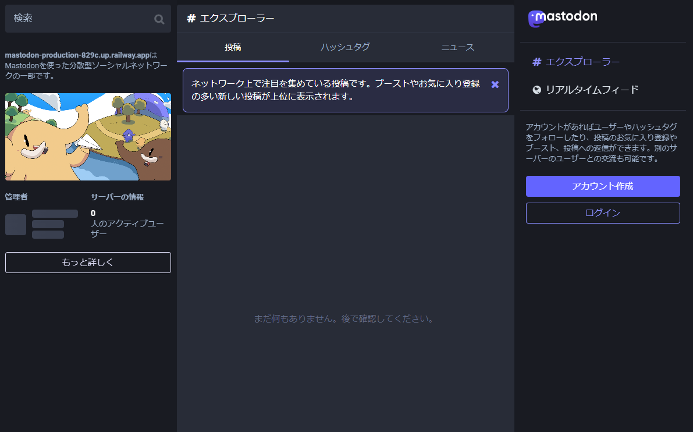
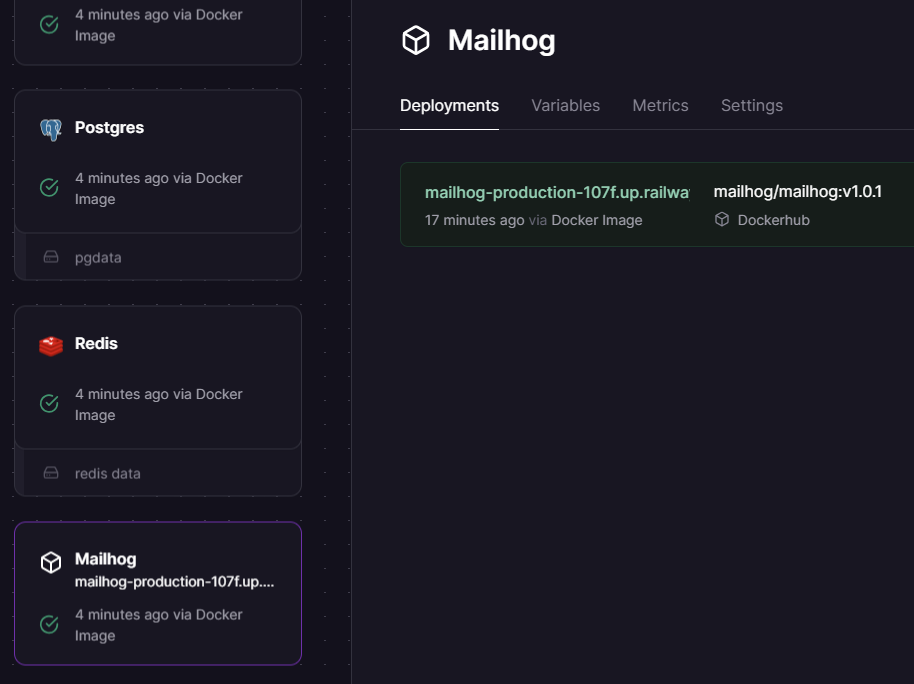
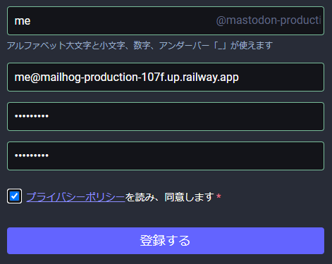
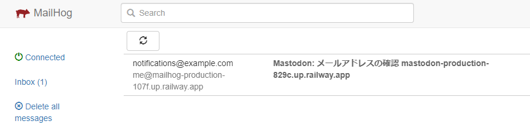
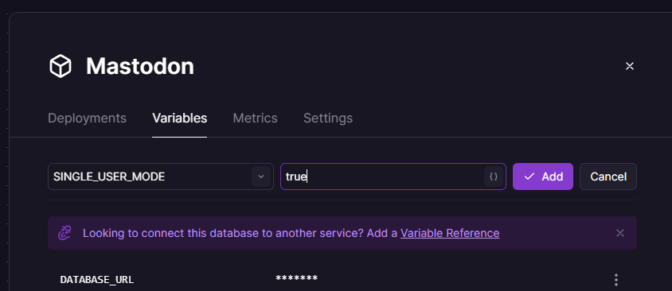
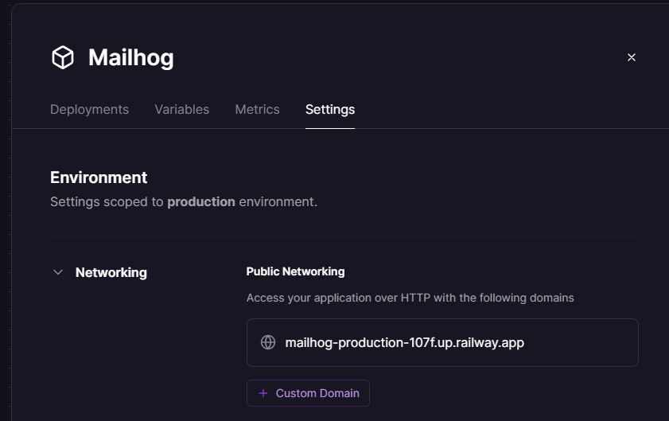

[English](./README.md) | [日本語](./README_ja.md)

# mastodon-railway-template
[Railway](https://railway.app)でMastodonをデプロイするためのテンプレートです。

## 使用方法

### 1. Deploy on Railwayをクリック

### 2. 各サービスの「Configure」をクリックして環境変数を設定

すべての設定の「Save Config」をクリックする必要があります。以下に各サービスの設定方法を記載します。

#### Mastodon-Streaming
「Mastodon」の環境変数と同期されるため、編集不要です。

#### Mailhog
編集不要です。

#### Mastodon
| 変数名 | 説明 | デフォルト |
| --- | --- | --- |
| LOCAL_DOMAIN | マストドンで使用するドメインを設定します。独自ドメインか、Railwayで利用できる無料ドメイン`{任意の文字列}.up.railway.app`を指定してください。| 自動生成されたドメイン |
| SMTP_SERVER SMTP_LOGIN SMTP_PASSWORD SMTP_FROM_ADDRESS | メールサーバーを使用したい場合は設定します。オープンなサーバーの場合は必須です。個人使用の場合は代わりにMailhogというツールを使用出来ます。 | Mailhogサーバー |

これら以外は編集不要です。

各設定について詳しくは[公式ドキュメント](https://docs.joinmastodon.org/admin/config/)を参照してください。

### 3. 設定完了後「Deploy」をクリック
以下の画像のように全て「Ready to be deployed」と表示されたらデプロイ出来ます。

### 4. 数分後、「Mastodon」サービスをクリックしてURLにアクセス
以下のような画面の「Deployments」にURLが表示されています。

以上で完了です！

## Mailhogを使ったアカウント作成(シングルユーザーモード)
まず、Mailhogを開きます。「Deployments」からURLを見つけてください。

その後、Mastodonの「アカウント作成」からアカウントを作成します。この時、メールアドレスは「{任意の名前}@{Mailhogのドメイン}」としてください。

アカウント登録後、Mailhogを確認するとメールが届いています。このメールからアカウントを認証してください。

アカウント認証が出来たら、他の人がアカウントを作成できないようにシングルユーザーモードを有効にします。「Mastodon」->「Variables」からSINGLE_USER_MODE、trueを入力して「Add」をクリックします。

最後に、他人がMailhogを使えないように「Mailhog」->「Settings」->「Networking」->「Public Networking」のドメインを削除してMailhogを非公開にしてください。

ドメインをマウスオーバーするとゴミ箱のマークが出てきます。

## 注意
- 簡単に動作させるためにMailhogを使用していますが、複数人での利用など、セキュリティを向上させるためにメールサービスを使用することをおすすめします。
- アップロードした画像はマウントされたボリュームに保存されます。ボリュームの容量は5GBのため、必要に応じてS3などを最初から設定しておくことをおすすめします。
- Railwayは使用量に応じて課金されるため、フォローを増やしすぎないでください。[設定から使用量を制限することも出来ます。](https://docs.railway.app/reference/usage-limits)
